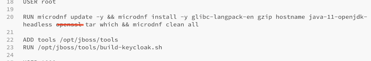

Keycloak + JSON Remote Claim Mapper
===================================

 

By Azrul MADISA

April 2020

 

Introduction
------------

Lets face it, adding extra claims in Keycloak’s access token is ‘messy’. You
have to create a jar file (containing a Java or Javascript application - yes,
Javascript - in a jar), upload it somewhere, modify some config file etc. So, if
we have to do it, we might as well do it ONCE and allow for dynamic claim to
come through it.

 

Keycloak has an extension that can help us here
[https://www.keycloak.org/extensions.html] called ‘JSON Remote Claim Mapper’.
This plugin will allow Keycloak, upon authentication, to call a third party
restful service, get back a JSON payload and integrate it to an access token.

This tutorial will go through the steps of integrating the JSON Remote Claim
Mapper extension to Keycloak, creating a Docker image and subsequently deploying
it to Kubernetes. For more information on the extension, please visit
<https://github.com/groupe-sii/keycloak-json-remote-claim>

 

Installation
------------

### Pre-requisites

-   A working Docker platform (e.g. Docker Desktop)

-   A running Kubernetes cluster

-   A working Helm installation. Follow the instructions here
    [<https://helm.sh/docs/intro/install/>] to install Helm

 

### Folder

We will create a project folder, say under /Users/\<user
name\>/Documents/Keycloak-JSON-Remote-Claim-Mapper. We will address this folder
as \$WORKING_FOLDER from now on

 

### Steps

-   Download config-azrulhasni.yaml into \$WORKING_FOLDER. This yaml file is
    Helm's configuration file

-   JSON Remote Claim Mapper is already integrated into the azrulhasni/keycloak
    image. The config-azrulhasni.yaml will use that image for installation. To
    install, run Helm:

~~~~~~~~~~~~~~~~~~~~~~~~~~~~~~~~~~~~~~~~~~~~~~~~~~~~~~~~~~~~~~~~~~~~~~~~~~~~~~~~
> helm install keycloak -f config-azrulhasni.yaml codecentric/keycloak
~~~~~~~~~~~~~~~~~~~~~~~~~~~~~~~~~~~~~~~~~~~~~~~~~~~~~~~~~~~~~~~~~~~~~~~~~~~~~~~~

 

 

Testing
-------

### Install Echo-Query

-   First, we will install Echo-Query as the target service we will call with
    JSON Remote Claim Mapper. Follow the tutorial here to install Echo-query
    [\<https://github.com/azrulhasni/Echo-query]\>

-   One difference is that, instead of exposing a LoadBalancer service, we will
    expose a NodePort service

~~~~~~~~~~~~~~~~~~~~~~~~~~~~~~~~~~~~~~~~~~~~~~~~~~~~~~~~~~~~~~~~~~~~~~~~~~~~~~~~
> kubectl expose deployment echoquery-app --type=NodePort --name=echoquery-http
~~~~~~~~~~~~~~~~~~~~~~~~~~~~~~~~~~~~~~~~~~~~~~~~~~~~~~~~~~~~~~~~~~~~~~~~~~~~~~~~

 

### Setup Keycloak

-   Firstly, expose Keycloak so that it is callable from outside of the cluster.

~~~~~~~~~~~~~~~~~~~~~~~~~~~~~~~~~~~~~~~~~~~~~~~~~~~~~~~~~~~~~~~~~~~~~~~~~~~~~~~~
> export POD_NAME=$(kubectl get pods --namespace default -l app.kubernetes.io/instance=keycloak -o jsonpath="{.items[0].metadata.name}")
  echo "Visit http://127.0.0.1:8080 to use Keycloak"
  kubectl port-forward --namespace default $POD_NAME 8080
~~~~~~~~~~~~~~~~~~~~~~~~~~~~~~~~~~~~~~~~~~~~~~~~~~~~~~~~~~~~~~~~~~~~~~~~~~~~~~~~

-   You can access Keycloak at http://localhost:8080/auth

-   Create your own Realm, Client and Users. Follow this tutorial if you need
    more detailed instructions
    [\<https://www.baeldung.com/spring-boot-keycloak]\>

-   Go to Clients \> [Your client id] \> Mappers \> ‘Create’ button.

    -   In the Mapper Type, choose JSON Remote Claim.

    -   Turn On Add to access token

    -   Set Token Claim Name as my-claim-data. This will be the JSON key where
        our data will be located

    -   Turn on Send user name

    -   Turn on Send client ID

    -   Set URL to
        <http://echoquery-http.default.svc.cluster.local:13600/echo/query>. This
        is the internal URL of the Echo Query service

    -   Save

 

### Authenticate

-   Run the curl command below:

~~~~~~~~~~~~~~~~~~~~~~~~~~~~~~~~~~~~~~~~~~~~~~~~~~~~~~~~~~~~~~~~~~~~~~~~~~~~~~~~
> curl -X POST \
  http://localhost:8080/auth/realms/ebanking/protocol/openid-connect/token \
  -H 'Authorization: Basic Og==' \
  -H 'Content-Type: application/x-www-form-urlencoded' \
  -H 'Postman-Token: 57123395-dcdc-49af-a385-d1d773fb41e4' \
  -H 'cache-control: no-cache' \
  -d 'username=<your keycloak user name>& password=<your keycloak user password>&client_id=<your client id>&client_secret=<your client secret>&grant_type=password&undefined='
~~~~~~~~~~~~~~~~~~~~~~~~~~~~~~~~~~~~~~~~~~~~~~~~~~~~~~~~~~~~~~~~~~~~~~~~~~~~~~~~

-   You will get the reply:

~~~~~~~~~~~~~~~~~~~~~~~~~~~~~~~~~~~~~~~~~~~~~~~~~~~~~~~~~~~~~~~~~~~~~~~~~~~~~~~~
{
    "access_token": <long access token>,
    "expires_in": 300,
    "refresh_expires_in": 1800,
    "refresh_token": <long refresh token>,
    "token_type": "bearer",
    "not-before-policy": 0,
    "session_state": "4c9ce4c6-0cec-4510-97c5-0c67c202c5b1",
    "scope": "profile email"
}
~~~~~~~~~~~~~~~~~~~~~~~~~~~~~~~~~~~~~~~~~~~~~~~~~~~~~~~~~~~~~~~~~~~~~~~~~~~~~~~~

-   Copy the \<long access token\>

-   Visit https://jwt.io. Paste the access token into the ‘Encoded’ field

-   Go to the bottom and you will see:

-   Note that the field name, my-claim-data is exactly what we specify in
    Keycloak.

 

Building on your own
--------------------

### Pre-requisite

-   Docker Hub subscription (get it here for free https://hub.docker.com) and a
    docker id

-   A working Docker platform

-   A running Kubernetes cluster

 

 

### Steps

-   Follow the instructions in
    [https://github.com/groupe-sii/keycloak-json-remote-claim] to obtain 3
    files. Put the 3 files under the \$WORKING_FOLDER:

    -   standalone.xml

    -   module.xml

    -   json-remote-claim.jar

-   You will also need the tools folder. Download the tools folder from
    <https://github.com/keycloak/keycloak-containers/tree/master/server/tools
    >and put the folder under \$WORKING_FOLDER

-   We would also need the Keycloak Dockerfile. Go to and copy the content of
    the tab Dockerfile to a an empty text file called Dockerfile. Place
    Dockerfile in \$WORKING_FOLDER

-   First, we need to make a few adjustments to Dockerfile

    -   Delete openssl

    

    -   To copy our files to their respective folders as instructed, we will use
        the COPY instruction. Add these instructions just above ‘USER 1000'

    ~~~~~~~~~~~~~~~~~~~~~~~~~~~~~~~~~~~~~~~~~~~~~~~~~~~~~~~~~~~~~~~~~~~~~~~~~~~~
    COPY json-remote-claim.jar /opt/jboss/keycloak/modules/system/layers/base/fr/sii/keycloak/mapper/json-remote-claim/main/
    COPY module.xml /opt/jboss/keycloak/modules/system/layers/base/fr/sii/keycloak/mapper/json-remote-claim/main/
    COPY standalone.xml /opt/jboss/keycloak/standalone/configuration/
    ~~~~~~~~~~~~~~~~~~~~~~~~~~~~~~~~~~~~~~~~~~~~~~~~~~~~~~~~~~~~~~~~~~~~~~~~~~~~

-   Next, build the docker image. Don’t forget the trailing dot.

~~~~~~~~~~~~~~~~~~~~~~~~~~~~~~~~~~~~~~~~~~~~~~~~~~~~~~~~~~~~~~~~~~~~~~~~~~~~~~~~
> docker build -t <your docker id>/keycloak:9.0.2 .
~~~~~~~~~~~~~~~~~~~~~~~~~~~~~~~~~~~~~~~~~~~~~~~~~~~~~~~~~~~~~~~~~~~~~~~~~~~~~~~~

-   Then push the image to Docker Hub

~~~~~~~~~~~~~~~~~~~~~~~~~~~~~~~~~~~~~~~~~~~~~~~~~~~~~~~~~~~~~~~~~~~~~~~~~~~~~~~~
> docker push <your docker id>/keycloak:9.0.2
~~~~~~~~~~~~~~~~~~~~~~~~~~~~~~~~~~~~~~~~~~~~~~~~~~~~~~~~~~~~~~~~~~~~~~~~~~~~~~~~

-   Then download values.yml from Codecentric Keycloak Helm repository
    <https://github.com/codecentric/helm-charts/blob/master/charts/keycloak/values.yaml>

-   Change the repository to point to your own image. Save the file as
    config-\<your docker id\>.yml.

~~~~~~~~~~~~~~~~~~~~~~~~~~~~~~~~~~~~~~~~~~~~~~~~~~~~~~~~~~~~~~~~~~~~~~~~~~~~~~~~
keycloak:
  replicas: 1

  image:
    repository: <your docker id>/keycloak
    tag: 9.0.2
    pullPolicy: IfNotPresent
~~~~~~~~~~~~~~~~~~~~~~~~~~~~~~~~~~~~~~~~~~~~~~~~~~~~~~~~~~~~~~~~~~~~~~~~~~~~~~~~

-   Run the installation instructions above to install. Make sure you use your
    own config-\<your docker id\>.yml file.
